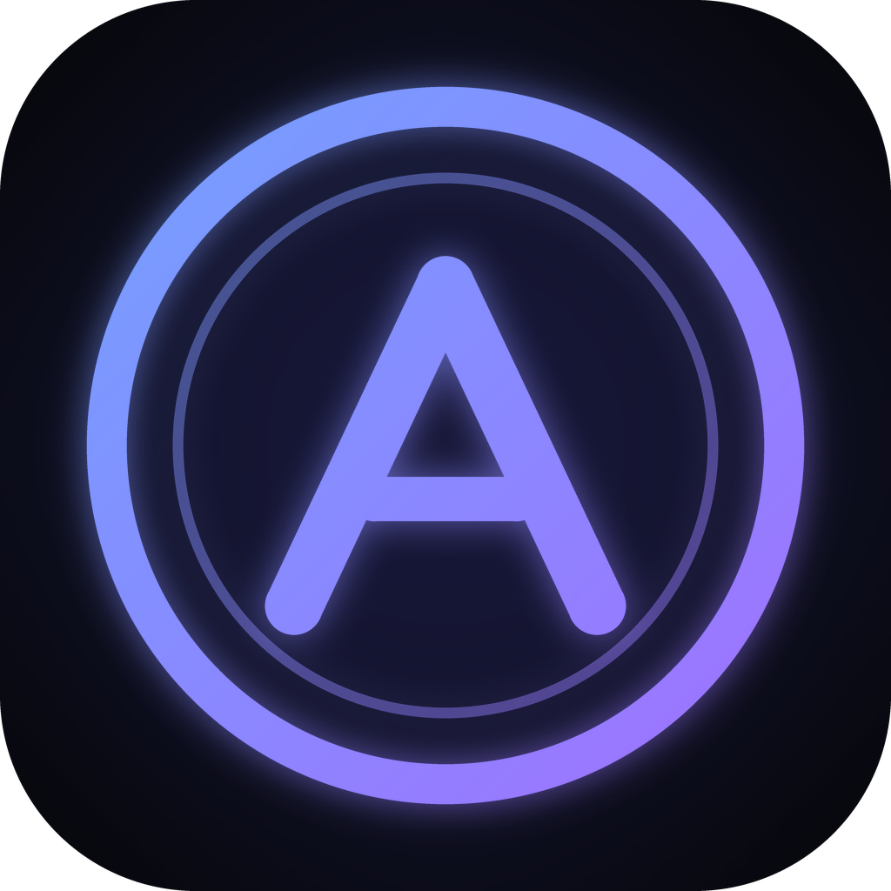

<p align="center"></p>

<h1 align="center">The Arena</h1>

<p align="center">A 31-day RPG calisthenics training PWA. Complete daily missions, earn XP, level up your stats and rank from E to S.<br>Bodyweight and dumbbells only. Works offline. Installable on iPhone, Android and desktop.</p>

> **Health notice:** The Arena is a general fitness program, not medical advice. Stop if you feel pain, dizziness, chest discomfort or shortness of breath. If you have a health condition, talk to a doctor before you start.

---

## Features

- **31-day program** in 6 phases: Awakening → The First Gate → Elite Hunter → Shadow Training → Final Dungeon → Rank Advancement. The mix of strength, conditioning, core, full-body, trial and recovery days increases gradually in difficulty.
- **Built-in timer.** Prep countdown, exercise timers, rest timers, rep sets with a stopwatch, start/pause/prev/next/skip, ±rest time, beeps, vibration (Android) and screen wake lock.
- **Automatic warm-up** before every training day.
- **Beginner-friendly variations.** Every exercise has easier and harder versions (e.g. wall → incline → knee → standard → tempo → decline push-up). Your choice is saved per exercise.
- **RPG system**
  - XP and levels: `100·(n−1)² + 400·(n−1)`, so L2 = 500, L3 = 1,200, L4 = 2,100 …
  - Four stats: STR, END, AGI, VIT. Each exercise contributes to specific stats.
  - Ranks E → A, earned by level **and** completed work **and** clearing phase trials. **S-Rank** needs Level 8, Day 31 cleared and being within 10% of your goal (or reaching it). Without a goal, it needs 2 full cycles plus an improved re-evaluation.
  - **Mission 0 — Hunter Evaluation.** All stats start at 0. Four tests (push-ups, 60-second squats, plank and balance/reach) set your starting STR/END/VIT/AGI with grades E–S and a recommended starting difficulty. Re-evaluating after a cycle adds your measured improvements to your stats.
  - 24 achievements.
- **Quests.** Every day has a main quest plus three optional ones: a daily quest (+25 XP), a **food challenge** (+30 XP; e.g. no soda, no added sugar, a vegetable with every meal, rotating through 31 challenges, with a muscle-gain list for gain goals) and a bonus quest (+50 XP). The water quest is personalized: about 35 ml per kg of body weight, shown in liters and ml (2 L default).
- **Body profile and BMI.** Age, gender, weight and height (kg/cm or lb/ft-in), with BMI, the WHO category and a gauge. Under-18s are told to use youth percentile charts instead.
- **Variation-based XP.** Each completed set earns XP at the multiplier for the variation you actually used: beginner ×0.8, standard ×1, advanced ×1.25 (skipped sets don't count). Mission screens show the XP for your current choices.
- **New Game+ cycles.** After Day 31, start Cycle 2, 3 and so on. Each cycle adds +20% reps, +15% timed sets and +15% XP (capped at cycle 3). Level, stats, rank (it never drops), streak, achievements and goal carry over, because real goals usually take longer than 31 days.
- **Goal pace adapts difficulty.** Choose how fast to lose or gain (Relaxed / Steady / Fast / Max safe). Loss is capped at 5 kg per 31 days (≈1.13 kg/week) and 1.5% of body weight per week, gain at 0.5 kg/week. You see a realistic timeline and a warning about how the pace changes workouts. Faster paces add sets, shorten rests and give +10–20% XP. Relaxed removes sets and lengthens rests. Gain goals shift volume from cardio to strength. Recovery days never change.
- **Goal weight / goal BMI.** Set a goal either way, log your weight, and see progress, the amount left to lose or gain, and a time estimate at 0.5 kg/week. Goals below a BMI of 18.5 are blocked.
- **Streaks.** Current and longest streak. Missing a day resets the streak but **never** your program progress.
- **"?" help during workouts.** Tap **?** in the workout to see an animated stick-figure demo, your current variation and its cue, step-by-step form instructions and a safety tip. The timer pauses while it's open. Figures also appear in mission lists, the exercise library and the evaluation tests (original illustrations, defined in `src/data/poses.js`).
- **Dungeon-style workouts.** A "Today's mission" gate (rank, phase, time, XP, active modifiers, ENTER DUNGEON), a "DUNGEON 03 / 06" counter with set pips during the workout, and "DUNGEON CLEARED" plus new records at the end.
- **Workout calendar and history.** A month calendar of workouts, recovery days and evaluations. Tap a day to see each workout's XP, duration, stat gains, modifiers and every set (variation, reps or time, dumbbell weight).
- **Personal records.** Tracked automatically: most reps in a set (per variation level), longest timed sets, heaviest dumbbell, Day 31 max-rep tests and evaluation bests. New records are celebrated on the finish screen. Log the reps you actually did (±1) and your dumbbell weight during the workout.
- **Exercise substitution.** "Can't do this? Replace" on every exercise (also inside the workout's ? help) offers alternatives that train similar muscles and stats. It applies everywhere until you restore the original, with reps and time converted automatically.
- **Hunter Evolution (Day 31).** After Day 31 the Final Evaluation repeats Mission 0 and shows a side-by-side table (Mission 0 vs now, with % change) plus stat evolution.
- **Recovery system.**
  - *Hunter Status* daily check-in (😴 / 😐 / ⚡ / 🔥): Exhausted lightens the workout, Excellent unlocks an optional Overdrive (+1 set on the first two exercises, +15% XP).
  - *Away detection*: after 3+ days away you can choose Recovery Mode (next 2 workouts: −1 set, +15 s rest) or resume normally.
  - *Rest-day protection*: after 4+ hard days in a row, "Recovery recommended" offers to log a recovery day (keeps your streak, max 2 per week) or a lighter workout. Starting a second mission on the same day also suggests resting.
- **Equipment profile.** No / fixed / adjustable dumbbells, plus your max weight. Without dumbbells every DB variation is skipped automatically. Weight logging never goes above your max.
- **Body measurements (optional).** Waist, chest, arms, thighs and hips, each graphed over time.
- **Progress graphs.** Mission XP over time, minutes per week, growth of each stat (separate charts) and body weight. Tap a chart for exact values.
- **Exercise library.** 36 movements with muscles, difficulty, equipment, instructions, a safety cue and beginner/standard/advanced variations.
- **Offline-first PWA.** Everything is precached, and progress lives in localStorage. Export/import backups are available from Profile.
- **Notifications.** Local reminders (daily mission, streak, mission complete, level/rank up) work now. The Web Push architecture is ready for background delivery (see below).

## Project structure

```
the-arena/
├─ index.html                 # App shell, iOS meta tags, splash links, boot screen
├─ vite.config.js             # Vite + plugin that injects the precache list into sw.js
├─ public/
│  ├─ manifest.json           # PWA manifest
│  ├─ sw.js                   # Service worker: offline cache + push + notification click
│  ├─ logo.svg                # The Arena logo (vector)
│  ├─ favicon.png
│  ├─ icons/                  # 192/512/maskable/apple-touch/badge/1024 icons
│  └─ splash/                 # iPhone launch screens
├─ docs/                      # ← BUILT APP (what GitHub Pages serves)
├─ src/
│  ├─ main.jsx                # Entry: providers, SW registration, persistent storage
│  ├─ App.jsx                 # Tab + stack navigation (Android back button aware)
│  ├─ data/
│  │  ├─ exercises.js         # Exercise database (36 exercises, variations, stat weights)
│  │  ├─ program.js           # 31-day program, phases, warm-up, quest XP
│  │  └─ achievements.js      # Achievement definitions + unlock tests
│  ├─ lib/
│  │  ├─ progression.js       # Levels, ranks, stats, streaks, duration estimates
│  │  ├─ game.js              # Pure game rules: completeDay(), toggleQuest(), achievements
│  │  ├─ workout.js           # Turns a day into timer steps
│  │  ├─ storage.js           # Versioned localStorage persistence, export/import
│  │  ├─ notifications.js     # Local notifications + reminder scheduling logic
│  │  ├─ push.js              # Web Push client (subscribe/sync/unsubscribe)
│  │  └─ feedback.js          # WebAudio beeps + vibration
│  ├─ state/GameContext.jsx   # React context + reducer, auto-save
│  ├─ hooks/useSystem.js      # Reminder scheduler, wake lock, install prompt, online status
│  ├─ components/             # Logo, Icons, UI kit, QuestList, VariationPicker, Body (BMI + goal)
│  ├─ screens/                # Onboarding, Home, Missions, MissionDetail, Workout,
│  │                          # Complete, Stats, Exercises, ExerciseDetail, Profile
│  └─ styles/                 # base.css (tokens), components.css, screens.css
├─ scripts/
│  ├─ make_icons.py           # Regenerates PNG icons + splash screens (Pillow)
│  └─ simulate.mjs            # Headless test: plays all 31 days, checks the rules
├─ push-server/               # Optional Node Web Push server (example)
└─ .github/workflows/deploy.yml  # GitHub Pages deployment
```

### Architecture in short

- **Data → rules → UI.** Program and exercise content are plain data. All game rules are pure functions in `lib/` (no React), so they're easy to test (`node scripts/simulate.mjs`) and could run on a server later.
- **State.** There's one state object (see `storage.js → initialState()`), held in a reducer and saved to localStorage after every change. Level, rank, streaks and next day are **derived**, never stored, so they can't drift out of sync.
- **Navigation.** Bottom tabs, plus a stack of full-screen views (mission → workout → complete). Each pushed view adds a history entry, so the phone's back gesture works.

## Run locally

Requires Node 18+.

```bash
npm install
npm run dev          # http://localhost:5173 (service worker disabled in dev)
```

To test the real PWA (offline, install, service worker):

```bash
npm run build
npm run preview      # http://localhost:4173
```

Optional checks:

```bash
node scripts/simulate.mjs   # plays the full program and prints XP / level / rank per day
npm run icons               # regenerate icons from the logo geometry (needs Python + Pillow)
```

## Build

```bash
npm run build
```

The output goes to `docs/`. It's fully static and uses relative paths, so it works at a domain root or in a sub-folder.

## Deploy

> **Important:** GitHub Pages must serve the **built** app in `/docs`, not the source code. If Pages serves the repo root, the app gets stuck on the logo screen (it now shows a message explaining this).

**GitHub Pages (simplest, no Actions needed)**

1. Push the whole project to GitHub, including the `docs/` folder.
2. Go to repo **Settings → Pages → Build and deployment**.
3. Set **Source: Deploy from a branch**, **Branch: `main`**, **Folder: `/docs`**, then click **Save**.
4. Wait about a minute. The app will be live at `https://<username>.github.io/<repo>/`.
5. After changing code, run `npm run build` (it rebuilds `docs/`), then commit and push.

**GitHub Pages via Actions (optional):** set Source to **GitHub Actions**. The included workflow runs `npm run build` on every push and deploys `docs/`.

**Any static host** (Netlify, Vercel, Cloudflare Pages, Firebase Hosting): set the build command to `npm run build` and the publish folder to `docs`. HTTPS is required for service workers and notifications.

**Served the source by mistake?** The root `index.html` detects that and redirects to `docs/` automatically, so the app works even if Pages points at the repo root.

**Stuck on the logo after an update?** Use the **Clear cache & reload** button on that screen. Your progress is kept.

## Install on iPhone

1. Open the app's URL in **Safari** (other iOS browsers can't install PWAs on older iOS versions).
2. Tap the **Share** button.
3. Tap **Add to Home Screen**, then **Add**.
4. Launch **The Arena** from the Home Screen. It opens full-screen, works offline and keeps your progress.

Android (Chrome): menu → **Install app**, or use the **Install** button on the Profile screen. Desktop (Chrome/Edge): click the install icon in the address bar.

## Notifications

### What works now (no backend)

After you enable notifications in **Profile → Reminders**, The Arena shows real system notifications through the service worker:

- the daily mission reminder at your chosen time ("Your daily mission is waiting, Hunter.")
- a streak reminder in the evening if you haven't trained
- mission complete
- level up and rank up

These local reminders fire while the app is open or running in the background. A closed web app can't schedule its own future notifications, so reliable reminders need Web Push.

On iPhone, notifications require **iOS 16.4+** and the app must be **installed to the Home Screen**. The app explains this when you try to enable them.

### What's needed for real background push

Everything on the client side is already built (`src/lib/push.js` and the `push` and `notificationclick` handlers in `public/sw.js`). To turn it on:

1. **Generate VAPID keys:**
   ```bash
   cd push-server && npm install && npx web-push generate-vapid-keys
   ```
2. **Run the push server** (`push-server/server.js`) on any Node host (Render, Railway, Fly.io, a VPS…):
   ```bash
   VAPID_PUBLIC_KEY=... VAPID_PRIVATE_KEY=... VAPID_SUBJECT=mailto:you@example.com \
   ALLOWED_ORIGIN=https://<username>.github.io npm start
   ```
   It stores subscriptions and sends the daily and streak reminders at each user's local time. Before going to production, swap its JSON file for a real database.
3. **Point the app at it.** Create a `.env` file (see `.env.example`), or for GitHub Actions set repository **Variables** with the same names:
   ```
   VITE_VAPID_PUBLIC_KEY=<public key>
   VITE_PUSH_SERVER_URL=https://your-push-server.example.com
   ```
4. **Rebuild and deploy.** A **Background reminders (Web Push)** toggle then appears in Profile. When the user turns it on, the app subscribes and sends its reminder time, toggles and timezone to the server. Completing a workout tells the server to skip that day's reminders.

## Data and privacy

There are no accounts, no analytics and no network calls (unless you configure a push server). All progress stays on the device in localStorage. Use **Profile → Data → Export** to back it up or move it to another device.

## Ideas for v2

- Optional account and cloud sync (e.g. Firebase), using the same state shape
- Logging rep counts on Day 31 and comparing them with Day 1
- A second 31-day cycle with harder base volumes ("New Game+")
- Rest-day reminders and weekly summaries via push
